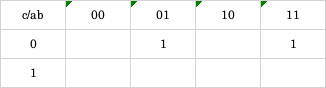

*__Question:__ Use predicates (i) through (iv) to answer questions*

i.

ii.

iii.

iv.

*__Answer:__*
 
- a. Draw the Karnaugh maps for f and f_.
    - i:
        - f:
        
        
        - f_:
          
        
        
    - ii:
        - f:
          
        
        - f_:
          
        
        
    - iii:
        - f:
          
        

        - f_:

        
      
    - iv:
        -f:
      
        
      
        -f_:
      
        
    
 

- b. Find the nonredundant prime implicant representation for f and
  f_.
  - i:
    - f = b(-c)
    - f_ = (-b) + c
    
  - ii:
    - f = (-a)(-b)(-c)(-d) + abcd
    - f_ = (-a)d + c(-d) + b(-c) + a(-b)
  - iii:
    - f = ab + (-b)c
    - f_ = (-a)b + (-b)(-c)
  - iv:
    - f = (-a)(-c) + bd + (-c)d
    - f_ = a(-d) + c(-d) + (-b)c
    
 

- c. Give a test set that satisfies Implicant Coverage (IC) for f.
    - i:
      - Implicants: {(-b), c, b(-c)}
      - T = {xTF, xFT}
    - ii:
      - Implicants: {(-a)(-b)(-c)(-d), abcd, (-a)d, c(-d), b(-c), a(-b)}
      - T = {FFFF, TTTT, FTFT, TFTF}
    - iii:
      - Implicants: {(-b)c, (-a)b, (-b)(-c)}
      - T = {TT-, -FT, FT-, -FF}
    - iv:
        - Implicants: {(-a)(-c), bd, (-c)d, a(-d), c(-d), (-b)c}
        - T = {FTFT, TFTF}
    

