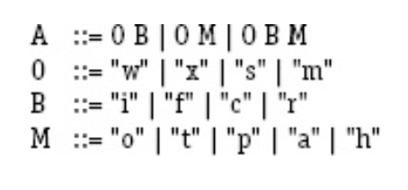

*__Question:__ Consider the following BNF*

*__Answer:__*
- *a. How many non-terminal symbols are in the grammar?*
  There are 4 non-terminal symbols.  
  
- *b. How many terminal symbols are in the grammar?*
  There are 13 terminal symbols.  
  
- *c. Write two strings that are valid according to the BNF.*
  The two strings are: "wo" and "xct"  
  
- *d. For each of your two strings, give two valid mutants of the
  string.*
    The valid mutants are: 
  - "wo" -> "wt", "xo"
  - "xct" -> "xcp", "xit'
    
- *e. For each of your two strings, give two invalid mutants of the
  string.*
    
  The invalid mutants are:
    - "wo" -> "ww", "oo"
    - "xct" -> "xxt", "cct"