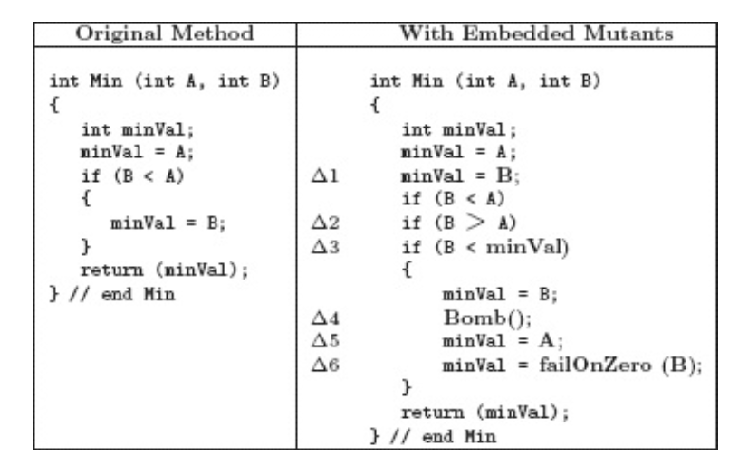

*__Question:__ Provide reachability conditions, infection conditions, propagation conditions, and test case values to kill mutants 2, 4, 5, and 6 in Figure 9.1.*

*__Answer:__*
- Mutant 2:
  - Reachability: Is reachable in any cases.
  - Infection: Infect if A != B.
  - Propagation: The infection will force another path.
  - Test case values: A = 2, B = 4.
- Mutant 4:
    - Reachability: Reach if B < A.
    - Infection: Infect the Bomb() method.
    - Propagation: Bomb() will propagate.
    - Test case values: A = 10, B = 2.
- Mutant 5:
    - Reachability: Reach if B < A.
    - Infection: Infect if A != B.
    - Propagation: minValue will be the value of the bigger variable.
    - Test case values: A = 7, B = 3.
- Mutant 6:
    - Reachability: Reach if B < A.
    - Infection: Infect if B = 0.
    - Propagation: The method fails.
    - Test case values: A = 2, B = 0.