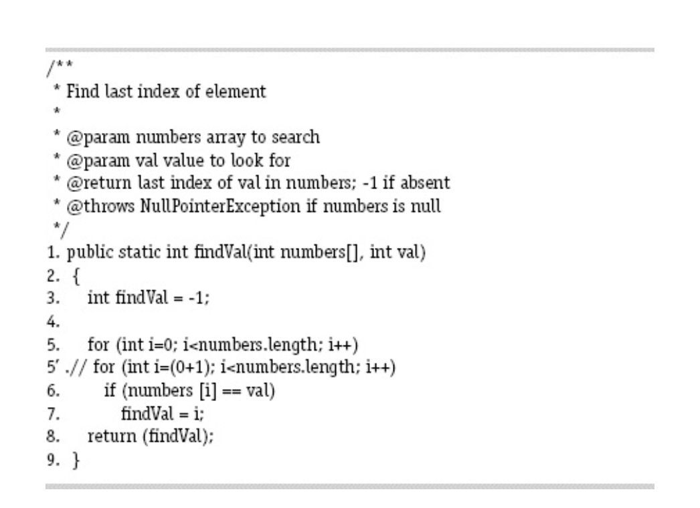

*__Question:__ Answer questions (a) through (d) for the mutant on line 5 in the method findVal().*

*__Answer:__*
  
- *a. If possible, find test inputs that do not reach the mutant.*
     It is impossible. The mutant will always reach no matter what.  
- *b. If possible, find test inputs that satisfy reachability but not
  infection for the mutant.*
    It is impossible. Infection will occur no matter what.  
- *c. If possible, find test inputs that satisfy infection, but not
  propagation for the mutant.*
    If the last occurrence of _val_ is not equal to _numbers[0]_, then the output will be correct. 
   Example: (numbers, val) = ([2, 3], 3)  
- *d. If possible, find test inputs that strongly kill the mutants.*
  To kill the mutants strongly, the _val_ will have to occur in _numbers[0]_ only. 
   Example: (numbers, val) = ([2, 3], 2) 

