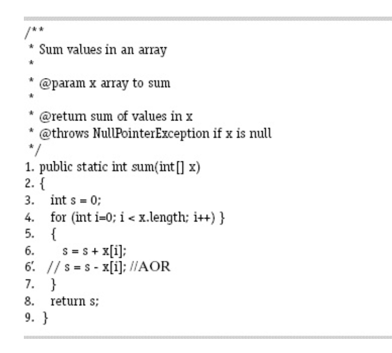

*__Question:__ Answer questions (a) through (d) for the mutant on line 6 in the method sum().*

*__Answer:__*
- *a. If possible, find test inputs that do not reach the mutant.*
     It is impossible. The mutant will always reach no matter what.  
- *b. If possible, find test inputs that satisfy reachability but not
  infection for the mutant.*
    It is impossible. Infection will occur no matter what.  
- *c. If possible, find test inputs that satisfy infection, but not
  propagation for the mutant.*
    If the sum of elements in x is equal to 0, then the output will be correct.
   Example: x = [4, 1, -5]  
- *d. If possible, find test inputs that strongly kill the mutants.*
    To kill the mutants strongly, all the elements in x will have the same sign (positive or negative).
   Example: x = [-1, -4, -3] 

